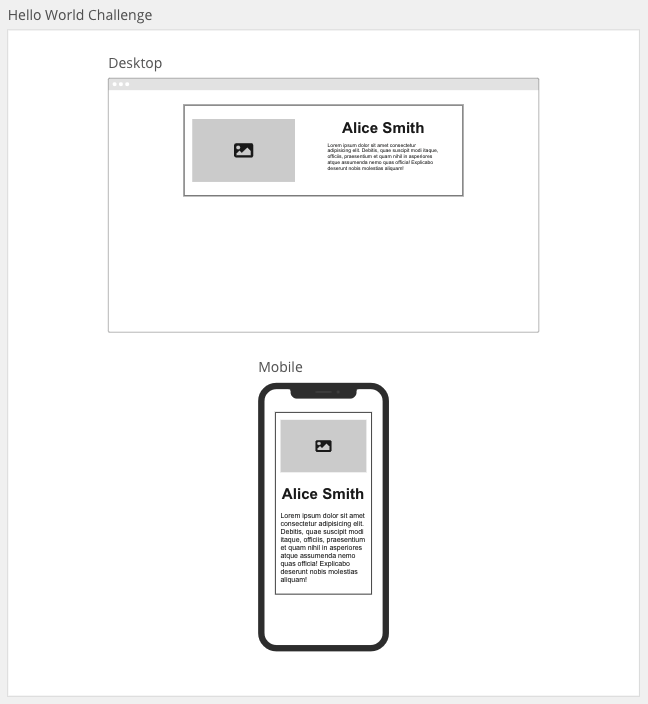

# Hello World

## User Story

> As a user I want to see some basic content being rendered via React.

## Acceptance Criteria

> Must use create-react-app scripts to create a react application `hello-world-react`

> Must contain an `App` component which renders another component `Introduction`

> The `Introduction` component should render some information about yourself such as: Full name, image and a short description about yourself.

> Must provide some basic styling and layout

> Must be viewport responsive

## Design Guide



## Getting Started

1. > Navigate to your `coding_bootcamp` workspace:

```
cd ~/coding_bootcamp
```

2. > Create a react project using the `create-react-app` script:

```
npx create-react-app hello-world-react
cd hello-world-react
```

3. > Create a repository in [GitHub](https://github.com/new) and enter the "Repository name" as the same name as your react app `hello-world-react`.

4. > In the terminal within your react app enter the commands provided by GitHub. The first command points your local repository to the remote GitHub, the second command sets your branch as `main` and the last command pushes all your local changes to the remote repository

```
git remote add origin git@github.com:YOUR_GITHUB_USERNAME/hello-world-react.git
git branch -M main
git push -u origin main
```

5. > Once you refresh your GitHub page on the web browser you will see all your local files in GitHub.

6. > You can now proceed to work locally and add commit and push code regularly during development

## Resources

- CSS framework: [Bootstrap 5](https://getbootstrap.com/docs/5.3/getting-started/introduction/)
- Colour palette: [coolors](https://coolors.co/)
- Icons: [font-awesome icons](https://fontawesome.com/icons) | [CDN](https://cdnjs.com/libraries/font-awesome)
- [React docs](https://beta.reactjs.org/)
