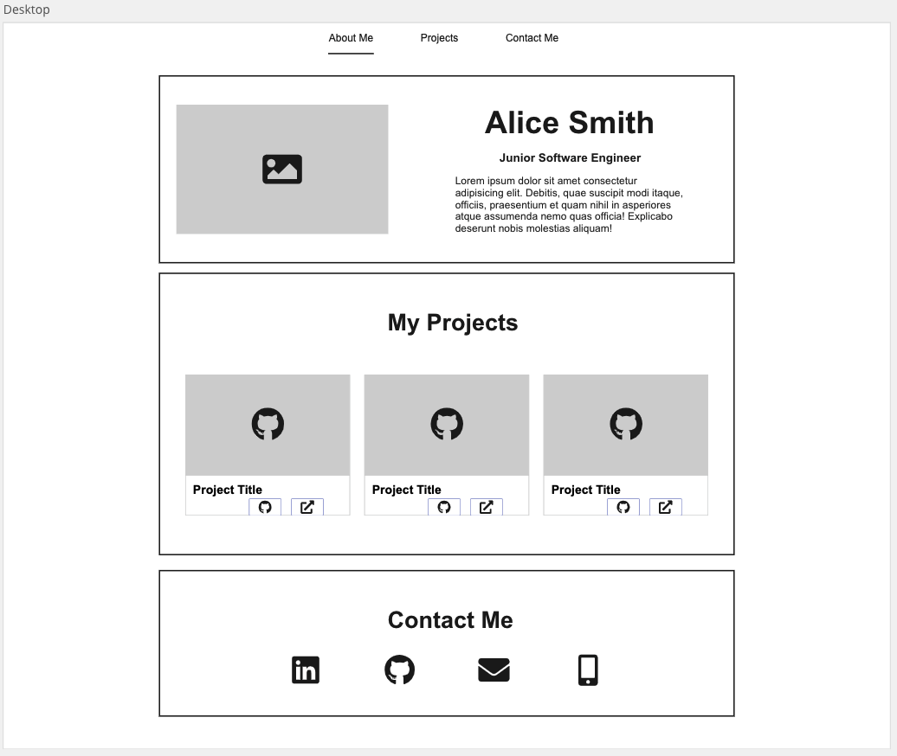
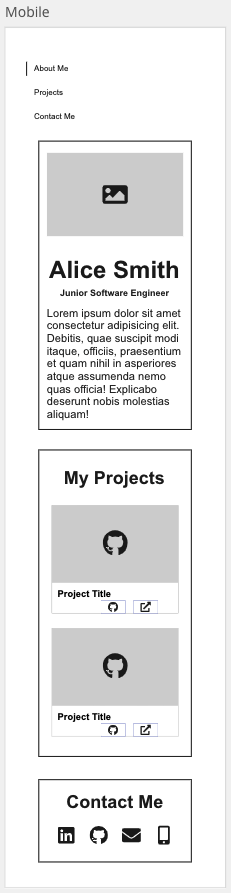

# React Portfolio

## User Story

> As a Junior Software Engineer seeking employment, I want to present my professional react portfolio to potential employers in the field of technology

## Acceptance Criteria

- Must contain a section about yourself which includes:
  - your full name
  - a photo of yourself
  - job title you are looking for
  - a short biography
- Must contain a section about your projects as a responsive list of project cards
- Each project card must contain:
  - An image (screenshot of application)
  - Title
  - Link to the source code (GitHub URL)
  - Link to the deployed application
- Must contain a contact section which includes the following links:
  - LinkedIn profile URL
  - GitHub profile URL
  - Email
  - Phone number (optional)
- Must contain a navigation bar that enables one to navigate to the different sections in your portfolio: About Me (#about-me), Projects (#projects), and Contact Me (#contact-me)

## Design Guide





## Getting Started

### 1. Go to your projects folder

Navigate to your `coding_bootcamp` workspace with the `cd` command

```sh
cd ~/coding_bootcamp
```

### 2. Create a react project

Use `create-react-app` script and use your own app name:

```sh
npx create-react-app your-app-name
cd your-app-name
```

### 3. Create a new repository

Goto [GitHub](https://github.com/new) and enter the "Repository name" as the same name as your react app.

### 4. Setup the new repository on your local machine

In the terminal within your react app enter the commands provided by GitHub

The first command points your local repository to the remote GitHub

The second command sets your branch as `main`

The last command pushes all your local changes to the remote repository

#### Comands from Github

```sh
git remote add origin git@github.com:YOUR_GITHUB_USERNAME/your-app-name.git
git branch -M main
git push -u origin main
```

### 5. Refresh your web browser

Once you refresh your GitHub page on the web browser you will see all your local files in GitHub

### 6. Work Locally

You can now proceed to work locally and add commit and push code regularly during development

## Resources

- [Bootstrap 5](https://getbootstrap.com/docs/5.3/getting-started/introduction/)
- [coolors](https://coolors.co/)
- [font-awesome icons](https://fontawesome.com/icons)
- [font-awesome icons CDN](https://cdnjs.com/libraries/font-awesome)
- [React docs](https://beta.reactjs.org/)
